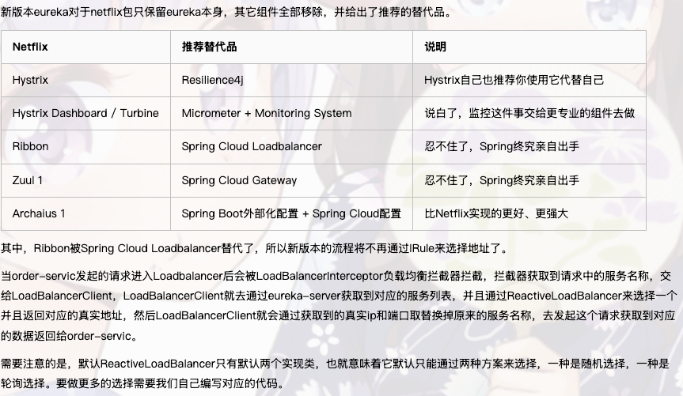
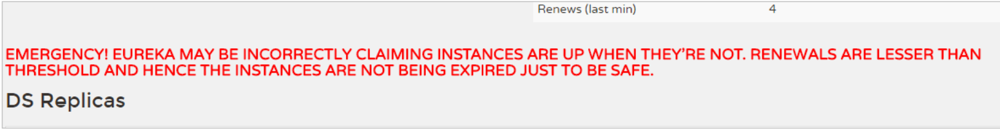

# Springboot3+Springcloud2023.0.4学习及踩坑记录

Spingboot3.2.12版本，对应springCloud2023.0.4，

springboot与springcloud版本对应：https://spring.io/projects/spring-cloud#overview

Spingboot3.4.1版本与idea中的gradle插件冲突无法启动，Spingboot3.3.7版本与eureka server冲突，无法启动



## Eureka注册与发现

假设有三个服务，Eureka注册中心，生产者（用户服务）、消费者

### 父工程

###### pom

```
<?xml version="1.0" encoding="UTF-8"?>
<project xmlns="http://maven.apache.org/POM/4.0.0" xmlns:xsi="http://www.w3.org/2001/XMLSchema-instance"
	xsi:schemaLocation="http://maven.apache.org/POM/4.0.0 https://maven.apache.org/xsd/maven-4.0.0.xsd">
	<modelVersion>4.0.0</modelVersion>
	<parent>
		<groupId>org.springframework.boot</groupId>
		<artifactId>spring-boot-starter-parent</artifactId>
		<version>3.2.12</version>
		<relativePath/> <!-- lookup parent from repository -->
	</parent>
	<groupId>com.ljl</groupId>
	<artifactId>springcloud</artifactId>
	<version>0.0.1-SNAPSHOT</version>
	<packaging>pom</packaging>
	<name>springcloud</name>
	<description>Demo project for Spring Boot</description>
	<url/>
	<licenses>
		<license/>
	</licenses>
	<developers>
		<developer/>
	</developers>
	<scm>
		<connection/>
		<developerConnection/>
		<tag/>
		<url/>
	</scm>
	<properties>
		<java.version>17</java.version>
		<spring-cloud.version>2023.0.4</spring-cloud.version>
	</properties>
	<dependencies>
		<dependency>
			<groupId>org.springframework.cloud</groupId>
			<artifactId>spring-cloud-dependencies</artifactId>
			<version>${spring-cloud.version}</version>
			<type>pom</type>
			<scope>import</scope>
		</dependency>

		<dependency>
			<groupId>org.springframework.boot</groupId>
			<artifactId>spring-boot-starter-web</artifactId>
		</dependency>

		<dependency>
			<groupId>org.projectlombok</groupId>
			<artifactId>lombok</artifactId>
			<version>1.18.30</version>
			<scope>provided</scope>
<!--			<optional>true</optional>-->
		</dependency>
		<dependency>
			<groupId>org.springframework.boot</groupId>
			<artifactId>spring-boot-starter-test</artifactId>
			<scope>test</scope>
		</dependency>
	</dependencies>

	<dependencyManagement>
		<dependencies>
			<dependency>
				<groupId>org.springframework.cloud</groupId>
				<artifactId>spring-cloud-dependencies</artifactId>
				<version>${spring-cloud.version}</version>
				<type>pom</type>
				<scope>import</scope>
			</dependency>
		</dependencies>
	</dependencyManagement>

	<build>
		<plugins>
			<plugin>
				<groupId>org.springframework.boot</groupId>
				<artifactId>spring-boot-maven-plugin</artifactId>
				<configuration>
					<excludes>
						<exclude>
							<groupId>org.projectlombok</groupId>
							<artifactId>lombok</artifactId>
						</exclude>
					</excludes>
				</configuration>
			</plugin>
		</plugins>
	</build>

</project>

```


### 生产者

###### pom

```
<?xml version="1.0" encoding="UTF-8"?>
<project xmlns="http://maven.apache.org/POM/4.0.0"
         xmlns:xsi="http://www.w3.org/2001/XMLSchema-instance"
         xsi:schemaLocation="http://maven.apache.org/POM/4.0.0 http://maven.apache.org/xsd/maven-4.0.0.xsd">
    <modelVersion>4.0.0</modelVersion>
    <parent>
        <groupId>com.ljl</groupId>
        <artifactId>springcloud</artifactId>
        <version>0.0.1-SNAPSHOT</version>
    </parent>

    <artifactId>user-service</artifactId>

    <properties>
        <maven.compiler.source>17</maven.compiler.source>
        <maven.compiler.target>17</maven.compiler.target>
        <project.build.sourceEncoding>UTF-8</project.build.sourceEncoding>
    </properties>

    <dependencies>
        <dependency>
            <groupId>org.mybatis.spring.boot</groupId>
            <artifactId>mybatis-spring-boot-starter</artifactId>
            <version>3.0.4</version>
        </dependency>
        <dependency>
            <groupId>com.mysql</groupId>
            <artifactId>mysql-connector-j</artifactId>
            <scope>runtime</scope>
        </dependency>
    </dependencies>
</project>
```

###### application.yml

```
server:
  port: ${port:9001}
spring:
  application:
    # 注册的服务id
    name: user-service
  datasource:
    driver-class-name: com.mysql.cj.jdbc.Driver
    username: root
    password: test
    url: jdbc:mysql://127.0.0.1:3306/springcloud?characterEncoding=utf-8&useSSL=false
  jackson:
    serialization:
      WRITE_DATES_AS_TIMESTAMPS: false
      FAIL_ON_EMPTY_BEANS: true
    time-zone: UTC
mybatis:
  type-aliases-package: com.ljl.user.domain
  mapper-locations: classpath:mapper/*.xml
logging:
  level:
    com: info
```

### 消费者

###### pom

```
<?xml version="1.0" encoding="UTF-8"?>
<project xmlns="http://maven.apache.org/POM/4.0.0"
         xmlns:xsi="http://www.w3.org/2001/XMLSchema-instance"
         xsi:schemaLocation="http://maven.apache.org/POM/4.0.0 http://maven.apache.org/xsd/maven-4.0.0.xsd">
    <modelVersion>4.0.0</modelVersion>
    <parent>
        <groupId>com.ljl</groupId>
        <artifactId>springcloud</artifactId>
        <version>0.0.1-SNAPSHOT</version>
    </parent>

    <artifactId>consumer</artifactId>

    <properties>
        <maven.compiler.source>17</maven.compiler.source>
        <maven.compiler.target>17</maven.compiler.target>
        <project.build.sourceEncoding>UTF-8</project.build.sourceEncoding>
    </properties>
    <dependencies>
        <dependency>
            <groupId>junit</groupId>
            <artifactId>junit</artifactId>
            <scope>test</scope>
        </dependency>
    </dependencies>

</project>
```

###### ConsumerApplication

```
import org.springframework.boot.SpringApplication;
import org.springframework.context.annotation.Bean;
import org.springframework.web.client.RestTemplate;

@SpringBootApplication
public class ConsumerApplication {

    @Bean
    public RestTemplate restTemplate() {
        return new RestTemplate();
    }

    public static void main(String[] args) {
        SpringApplication.run(ConsumerApplication.class, args);
    }
}
```

###### ConsumerController

```
@RestController
@RequestMapping("/consumer")
public class ConsumerController {

  @Autowired
  private RestTemplate restTemplate;
  
  @GetMapping("/{id}")
  public User queryById(@PathVariable Long id){
    String url =
    "HTTP://localhost:9001/user/" + id;
    return restTemplate.getForObject(url, User.class);
  }
}
```

访问 http://localhost:8080/consume/7

### 服务注册中心

###### pom

```
<?xml version="1.0" encoding="UTF-8"?>
<project xmlns="http://maven.apache.org/POM/4.0.0"
         xmlns:xsi="http://www.w3.org/2001/XMLSchema-instance"
         xsi:schemaLocation="http://maven.apache.org/POM/4.0.0 http://maven.apache.org/xsd/maven-4.0.0.xsd">
    <modelVersion>4.0.0</modelVersion>
    <parent>
        <groupId>com.ljl</groupId>
        <artifactId>springcloud</artifactId>
        <version>0.0.1-SNAPSHOT</version>
    </parent>

    <artifactId>eureka-server</artifactId>

    <properties>
        <maven.compiler.source>17</maven.compiler.source>
        <maven.compiler.target>17</maven.compiler.target>
        <project.build.sourceEncoding>UTF-8</project.build.sourceEncoding>
        <spring-cloud.version>2023.0.0</spring-cloud.version>
    </properties>

    <dependencies>
        <dependency>
            <groupId>org.springframework.cloud</groupId>
            <artifactId>spring-cloud-starter-netflix-eureka-server</artifactId>
        </dependency>
    </dependencies>


    <build>
        <plugins>
            <plugin>
                <groupId>org.springframework.boot</groupId>
                <artifactId>spring-boot-maven-plugin</artifactId>
            </plugin>
        </plugins>
    </build>
</project>
```

###### application.yml

```
server:
  port: ${port:10086}
spring:
  application:
    name: eureka-server
eureka:
  client:
    service-url:
      # eureka 服务地址，如果是集群的话；需要指定其它集群eureka地址
      defaultZone: ${defaultZone:http://127.0.0.1:10086/eureka}
    # 不注册自己
    register-with-eureka: false
    # 不拉取服务
    fetch-registry: false
```

###### EurekaServerApplication

```
import org.springframework.boot.SpringApplication;
import org.springframework.boot.autoconfigure.SpringBootApplication;
import org.springframework.cloud.netflix.eureka.server.EnableEurekaServer;

// 声明是Eureka服务中心
@EnableEurekaServer
@SpringBootApplication
public class EurekaServerApplication {
    public static void main(String[] args) {
        SpringApplication.run(EurekaServerApplication.class, args);
    }
}
```

访问 http://127.0.0.1:10086/

#### 服务注册

user-service上添加eureka的客户端依赖 并且自动注册到eureka服务端上

###### pom

```
	<dependency>
    <groupId>org.springframework.cloud</groupId>
    <artifactId>spring-cloud-starter-netflix-eureka-client</artifactId>
  </dependency>
```

###### UserApplication

```
// 开启Eureka服务端
@MapperScan("com.ljl.user.mapper")
@SpringBootApplication
@EnableDiscoveryClient
public class UserApplication {
    public static void main(String[] args) {
        SpringApplication.run(UserApplication.class, args);
    }
}
```

###### application.yml添加配置

```
server:
  port: ${port:9001}
spring:
  application:
    # 注册的服务id
    name: user-service
  datasource:
    driver-class-name: com.mysql.cj.jdbc.Driver
    username: root
    password: test
    url: jdbc:mysql://127.0.0.1:3306/springcloud?characterEncoding=utf-8&useSSL=false
  jackson:
    serialization:
      WRITE_DATES_AS_TIMESTAMPS: false
      FAIL_ON_EMPTY_BEANS: true
    time-zone: UTC
mybatis:
  type-aliases-package: com.ljl.user.domain
  mapper-locations: classpath:mapper/*.xml
eureka:
  client:
    service-url:
      defaultZone: HTTP://127.0.0.1:10086/eureka
    register-with-eureka: true
  instance:
    ip-address: 127.0.0.1
    prefer-ip-address: true
    # 续约时间 心跳
    lease-renewal-interval-in-seconds: 30
    # 失效时间
    lease-expiration-duration-in-seconds: 90
logging:
  level:
    com: info
```

#### 服务发现

consumer上添加依赖注册到eureka上

###### pom

```
 <dependency>
   <groupId>org.springframework.cloud</groupId>
   <artifactId>spring-cloud-starter-netflix-eureka-client</artifactId>
 </dependency>
```

###### application.yml

```
spring:
  application:
    name: consumer
eureka:
  client:
    service-url:
      defaultZone: http://127.0.0.1:10086/eureka
logging:
  level:
    io.github.resilience4j: DEBUG
    org.springframework.web.client: DEBUG
    com.ljl.consumer: DEBUG
    org.springframework.cloud.circuitbreaker: DEBUG


```

###### ConsumerApplication

```
import com.ljl.consumer.config.CustomLoadBalancerConfiguration;
import org.springframework.boot.SpringApplication;
import org.springframework.boot.autoconfigure.SpringBootApplication;
import org.springframework.cloud.client.discovery.EnableDiscoveryClient;
import org.springframework.cloud.client.loadbalancer.LoadBalanced;
import org.springframework.cloud.loadbalancer.annotation.LoadBalancerClient;
import org.springframework.cloud.loadbalancer.annotation.LoadBalancerClients;
import org.springframework.cloud.openfeign.EnableFeignClients;
import org.springframework.context.annotation.Bean;
import org.springframework.web.client.RestTemplate;

@SpringBootApplication
@EnableDiscoveryClient
public class ConsumerApplication {

    @Bean
    public RestTemplate restTemplate() {
        return new RestTemplate();
    }

    public static void main(String[] args) {
        SpringApplication.run(ConsumerApplication.class, args);
    }
}
```

###### ConsumerController

```
import com.fasterxml.jackson.core.JsonProcessingException;
import com.fasterxml.jackson.databind.ObjectMapper;
import com.ljl.consumer.domain.dto.User;
import jakarta.annotation.Resource;
import lombok.extern.slf4j.Slf4j;
import org.slf4j.Logger;
import org.slf4j.LoggerFactory;
import org.springframework.web.bind.annotation.GetMapping;
import org.springframework.web.bind.annotation.PathVariable;
import org.springframework.web.bind.annotation.RequestMapping;
import org.springframework.web.bind.annotation.RestController;
import org.springframework.web.client.RestTemplate;

import static com.ljl.consumer.utils.constant.LimterConstant.*;


@Slf4j
@RestController
@RequestMapping("/consumer")
public class ConsumerController {

    private Logger logger = LoggerFactory.getLogger(ConsumerController.class);

    @Resource
    private RestTemplate restTemplate;

    @GetMapping("/user/{id}")
    public User queryById(@PathVariable Long id) throws JsonProcessingException {
       List<ServiceInstance> serviceInstances =
         discoveryClient.getInstances("user-service");
         ServiceInstance serviceInstance = serviceInstances.get(0);
       String url =
         "http://" + serviceInstance.getHost() + ":" +
         serviceInstance.getPort() + "/user/" + id;
         return restTemplate.getForObject(url, User.class);
    }

    // 回退方法，当熔断器触发时调用
    public User fallback(Long id, Throwable t) {
        logger.error("服务不可用，进入回退方法: {}", t.getMessage());
        User user = new User();
        user.setId(id);
        if( t instanceof RequestNotPermitted)
            user.setName("请求过于频繁，请稍后再试。");
        else
            user.setName("服务暂时不可用，请稍后再试。");
        return user;
    }
}
```

###### 生产者需要提供心跳

###### application.yml

```java
eureka:
  client:
    service-url:
      defaultZone: HTTP://127.0.0.1:10086/eureka
    register-with-eureka: true
  instance:
    ip-address: 127.0.0.1
    prefer-ip-address: true
    # 续约时间 心跳
    lease-renewal-interval-in-seconds: 30
    # 失效时间
    lease-expiration-duration-in-seconds: 90
```

###### 消费者拉取最新服务列表

###### consumer端 application.yml

```
eureka:
  client:
    service-url:
      defaultZone: http://127.0.0.1:10086/eureka
    # 每隔30秒 会重新拉取并更新数据,为了得到服务最新状态
    registry-fetch-interval-seconds: 30
```


#### 续约与失败剔除和关闭自我保护（关闭自我保护确保可以成功剔除失效的，开发阶段关闭 投入使用时开启）

##### 服务下线：

当服务进行正常关闭操作时，它会触发一个服务下线的REST请求给Eureka Server，告诉服务注册中

心：“我要下线了”。服务中心接受到请求之后，将该服务置为下线状态

##### 失效剔除

有时我们的服务可能由于内存溢出或网络故障等原因使得服务不能正常的工作，而服务注册中心并未收

到“服务下线”的请求。相对于服务提供者的“服务续约”操作，服务注册中心在启动时会创建一个定时任

务，默认每隔一段时间（默认为60秒）将当前清单中超时（默认为90秒）没有续约的服务剔除，这个操

作被称为失效剔除。 可以通过 eureka.server.eviction-interval-timer-in-ms 参数对其进行修改，单位是毫秒。

##### 自我保护

我们关停一个服务，就会在Eureka面板看到一条警告：



这是触发了Eureka的自我保护机制。当一个服务未按时进行心跳续约时，Eureka会统计最近15分钟心跳

失败的服务实例的比例是否超过了85%，当EurekaServer节点在短时间内丢失过多客户端（可能发生了

网络分区故障）。在生产环境下，因为网络延迟等原因，心跳失败实例的比例很有可能超标，但是此时

就把服务剔除列表并不妥当，因为服务可能没有宕机。Eureka就会把当前实例的注册信息保护起来，不

予剔除。生产环境下这很有效，保证了大多数服务依然可用。

但是这给我们的开发带来了麻烦， 因此开发阶段我们都会关闭自我保护模式：

###### eureka-server端application.yml

```
eureka:
  client:
    service-url:
      # eureka 服务地址，如果是集群的话；需要指定其它集群eureka地址
      defaultZone: ${defaultZone:http://127.0.0.1:10086/eureka}
    # 不注册自己
    register-with-eureka: false
    # 不拉取服务
    fetch-registry: false
  server:
    #    失效剔除时间 ms
    eviction-interval-timer-in-ms: 1000
    #    关闭自我保护模式
    #    当一个服务未按时进行心跳续约时，Eureka会统计最近15分钟心跳
    #    失败的服务实例的比例是否超过了85%，当EurekaServer节点在短时间内丢失过多客户端（可能发生了
    #    网络分区故障）。在生产环境下，因为网络延迟等原因，心跳失败实例的比例很有可能超标，但是此时
    #    就把服务剔除列表并不妥当，因为服务可能没有宕机。Eureka就会把当前实例的注册信息保护起来，不
    #    予剔除。生产环境下这很有效，保证了大多数服务依然可用。
    enable-self-preservation: false
```


## 负载均衡

springboot3中ribbon（负责负载均衡的）被弃用，使用spring-cloud-starter-loadbalancer进行负载均衡，修改负载策略只能通过配置类修改

###### pom

```
    <dependency>
      <groupId>org.springframework.cloud</groupId>
      <artifactId>spring-cloud-starter-loadbalancer</artifactId>
    </dependency>
```

###### CustomLoadBalancerConfiguration

```
import org.springframework.cloud.client.ServiceInstance;
import org.springframework.cloud.loadbalancer.core.RandomLoadBalancer;
import org.springframework.cloud.loadbalancer.core.ReactorLoadBalancer;
import org.springframework.cloud.loadbalancer.core.ServiceInstanceListSupplier;
import org.springframework.cloud.loadbalancer.support.LoadBalancerClientFactory;
import org.springframework.context.annotation.Bean;
import org.springframework.core.env.Environment;

public class CustomLoadBalancerConfiguration {

    @Bean
    ReactorLoadBalancer<ServiceInstance> randomLoadBalancer(Environment environment,
                                                            LoadBalancerClientFactory loadBalancerClientFactory) {
        String name = environment.getProperty(LoadBalancerClientFactory.PROPERTY_NAME);
        return new RandomLoadBalancer(loadBalancerClientFactory
                .getLazyProvider(name, ServiceInstanceListSupplier.class),
                name);
    }
}
```

###### ConsumerApplication

```
package com.ljl.consumer;

import com.ljl.consumer.config.CustomLoadBalancerConfiguration;
import org.springframework.boot.SpringApplication;
import org.springframework.boot.autoconfigure.SpringBootApplication;
import org.springframework.cloud.client.discovery.EnableDiscoveryClient;
import org.springframework.cloud.client.loadbalancer.LoadBalanced;
import org.springframework.cloud.loadbalancer.annotation.LoadBalancerClient;
import org.springframework.context.annotation.Bean;
import org.springframework.web.client.RestTemplate;


@SpringBootApplication
@EnableDiscoveryClient
@LoadBalancerClient(value = "user-service", configuration = CustomLoadBalancerConfiguration.class)
public class ConsumerApplication {

    @Bean
    @LoadBalanced
    public RestTemplate restTemplate() {
        return new RestTemplate();
    }

    public static void main(String[] args) {
        SpringApplication.run(ConsumerApplication.class, args);
    }

}

```

value是被负载均衡的名，configuration就是对应写的类

修改策略教程：https://www.cnblogs.com/itxiaoshen/p/16247702.html

 [微服务生态组件之Spring Cloud LoadBalancer详解和源码分析 - itxiaoshen - 博客园.html](Notes/Spring Cloud LoadBalancer详解/微服务生态组件之Spring Cloud LoadBalancer详解和源码分析 - itxiaoshen - 博客园.html) 

测试时开了两个user-service，复制后改vm运行参数 `-Dport=9002` (意思就是更换端口运行第二个user-service)

## Resilience4j 可做熔断器和限流器：

Hystrix也被弃用，推荐使用**Resilience4j**

###### pom

```
				<!-- Resilience4j Spring Boot Starter -->
        <dependency>
            <groupId>org.springframework.cloud</groupId>
            <artifactId>spring-cloud-starter-circuitbreaker-resilience4j</artifactId>
        </dependency>
        <dependency>
            <groupId>io.github.resilience4j</groupId>
            <artifactId>resilience4j-spring-boot3</artifactId>
        </dependency>
        <!-- 由于断路保护等需要AOP实现，所以必须导入AOP包 -->
        <dependency>
            <groupId>org.springframework.boot</groupId>
            <artifactId>spring-boot-starter-aop</artifactId>
        </dependency>
```

总的pom

```
<?xml version="1.0" encoding="UTF-8"?>
<project xmlns="http://maven.apache.org/POM/4.0.0"
         xmlns:xsi="http://www.w3.org/2001/XMLSchema-instance"
         xsi:schemaLocation="http://maven.apache.org/POM/4.0.0 http://maven.apache.org/xsd/maven-4.0.0.xsd">
    <modelVersion>4.0.0</modelVersion>
    <parent>
        <groupId>com.ljl</groupId>
        <artifactId>springcloud</artifactId>
        <version>0.0.1-SNAPSHOT</version>
    </parent>

    <artifactId>consumer</artifactId>

    <properties>
        <maven.compiler.source>17</maven.compiler.source>
        <maven.compiler.target>17</maven.compiler.target>
        <project.build.sourceEncoding>UTF-8</project.build.sourceEncoding>
    </properties>
    <dependencies>
        <dependency>
            <groupId>org.springframework.cloud</groupId>
            <artifactId>spring-cloud-starter-netflix-eureka-client</artifactId>
        </dependency>
        <dependency>
            <groupId>org.springframework.cloud</groupId>
            <artifactId>spring-cloud-starter-loadbalancer</artifactId>
        </dependency>
        <dependency>
            <groupId>junit</groupId>
            <artifactId>junit</artifactId>
            <scope>test</scope>
        </dependency>
        <!-- Resilience4j Spring Boot Starter -->
        <dependency>
            <groupId>org.springframework.cloud</groupId>
            <artifactId>spring-cloud-starter-circuitbreaker-resilience4j</artifactId>
        </dependency>
        <dependency>
            <groupId>io.github.resilience4j</groupId>
            <artifactId>resilience4j-spring-boot3</artifactId>
        </dependency>
        <!-- 由于断路保护等需要AOP实现，所以必须导入AOP包 -->
        <dependency>
            <groupId>org.springframework.boot</groupId>
            <artifactId>spring-boot-starter-aop</artifactId>
        </dependency>
        <!-- feign调用 -->
        <dependency>
            <groupId>org.springframework.cloud</groupId>
            <artifactId>spring-cloud-starter-openfeign</artifactId>
        </dependency>
    </dependencies>
</project>
```


### 熔断器

###### Application.yml

```
resilience4j:
	# 熔断器
	circuitbreaker:
    # 定义不同的熔断器实例
    instances:
      # 熔断器名称
      myCircuitBreaker:
        base-config: default
    configs:
      default:
        # 是否注册健康指示器 用于监控
        register-health-indicator: true
        # 滑动窗口大小 用于统计失败率
        sliding-window-size: 10
        # 触发熔断器的前的最小调用次数
        minimum-number-of-calls: 3
        # 失败率阈值 超过该值断路器将打开
        failure-rate-threshold: 50
        # 断路器打开后等待的秒
        wait-duration-in-open-state: 10s
        # 半开状态下允许的调用次数
        permitted-number-of-calls-in-half-open-state: 3
        # 是否自动从打开状态过渡到半开状态
        automatic-transition-from-open-to-half-open-enabled: true
        # 捕获所有异常
        record-exceptions:
          - java.lang.Exception
          - java.lang.RuntimeException
          - java.lang.Throwable
```

###### ConsumerApplication

<!--需要加LoadBalanced才能开启熔断器-->

```
import com.ljl.consumer.config.CustomLoadBalancerConfiguration;
import org.springframework.boot.SpringApplication;
import org.springframework.boot.autoconfigure.SpringBootApplication;
import org.springframework.cloud.client.discovery.EnableDiscoveryClient;
import org.springframework.cloud.client.loadbalancer.LoadBalanced;
import org.springframework.cloud.loadbalancer.annotation.LoadBalancerClient;
import org.springframework.cloud.loadbalancer.annotation.LoadBalancerClients;
import org.springframework.context.annotation.Bean;
import org.springframework.web.client.RestTemplate;

@SpringBootApplication
@EnableDiscoveryClient
@LoadBalancerClients({
        @LoadBalancerClient(value = "user-service", configuration = CustomLoadBalancerConfiguration.class),
        @LoadBalancerClient(value = "root-service", configuration = CustomLoadBalancerConfiguration.class)
})
public class ConsumerApplication {

    @Bean
    @LoadBalanced
    public RestTemplate restTemplate() {
        return new RestTemplate();
    }

    public static void main(String[] args) {
        SpringApplication.run(ConsumerApplication.class, args);
    }
}
```

###### ConsumerController

```
import com.ljl.consumer.domain.dto.User;
import io.github.resilience4j.circuitbreaker.annotation.CircuitBreaker;
import jakarta.annotation.Resource;
import lombok.extern.slf4j.Slf4j;
import org.springframework.web.bind.annotation.GetMapping;
import org.springframework.web.bind.annotation.PathVariable;
import org.springframework.web.bind.annotation.RequestMapping;
import org.springframework.web.bind.annotation.RestController;
import org.springframework.web.client.RestTemplate;

@Slf4j
@RestController
@RequestMapping("/consumer")
public class ConsumerController {

    @Resource
    private RestTemplate restTemplate;

    private static final String CIRCUIT_BREAKER_NAME = "myCircuitBreaker";
    private static final String USER_SERVICE_NAME = "user-service";
    private static final String ROOT_SERVICE_NAME = "root-service";

    // @CircuitBreaker：应用断路器，指定断路器名称和回退方法。
    // fallback(Throwable t)：当断路器打开或服务调用失败时调用的回退方法。
    @GetMapping("/user/{id}")
    @CircuitBreaker(name = CIRCUIT_BREAKER_NAME, fallbackMethod = "myCircuitFallback")
    public User queryById(@PathVariable Long id) {
        if (id < 0) {
            log.error("id不能为负");
            throw new RuntimeException("Invalid id");
        }

        String url = "http://user-service/user/" + id;
        return restTemplate.getForObject(url, User.class);
    }

    @GetMapping("/root/{id}")
    public User queryRootById(@PathVariable Long id) {
        String url = "http://root-service/root/" + id;
        return restTemplate.getForObject(url, User.class);
    }

    // 回退方法，当熔断器触发时调用，参数和返回值需要与被熔断的方法相同（参数在原来基础上加Throwable）
    public User myCircuitFallback(Long id, Throwable t) {
        log.error("服务不可用，进入回退方法: {}", t.getMessage());
        User fallbackUser = new User();
        fallbackUser.setId(id);
        fallbackUser.setName("服务暂时不可用，请稍后再试。");
        return fallbackUser;
    }
}
```

断路器状态监测

```
import io.github.resilience4j.circuitbreaker.CircuitBreaker;
import io.github.resilience4j.circuitbreaker.CircuitBreakerRegistry;
import org.slf4j.Logger;
import org.slf4j.LoggerFactory;
import org.springframework.stereotype.Component;

import static com.ljl.consumer.utils.constant.LimterConstant.CIRCUIT_BREAKER_NAME;

//监听熔断器状态
@Component
public class CircuitBreakerEventListener {

    private final Logger logger = LoggerFactory.getLogger(CircuitBreakerEventListener.class);

    public CircuitBreakerEventListener(CircuitBreakerRegistry circuitBreakerRegistry) {
        // 获取注册的熔断器实例
        CircuitBreaker circuitBreaker = circuitBreakerRegistry.circuitBreaker(CIRCUIT_BREAKER_NAME);
        // 注册监听器
        circuitBreaker.getEventPublisher()
                .onStateTransition(event -> {
                    logger.debug("服务器状态: " + event);
                })
                .onFailureRateExceeded(event -> {
                    logger.debug("故障率超标: " + event);
                })
                .onCallNotPermitted(event -> {
                    logger.debug("超过调用失败次数，服务被禁止调用: " + event);
                })
                .onError(event -> {
                    logger.error("服务调用失败: " + event);
                })
                .onSuccess(event -> {
                    logger.debug("服务调用成功: " + event);
                });
    }
}

```

### 限流器

###### application.yml

```
resilience4j:
	# 熔断器
  circuitbreaker:
    # 定义不同的熔断器实例
    instances:
      # 熔断器名称
      myCircuitBreaker:
        base-config: default
    configs:
      default:
        # 是否注册健康指示器 用于监控
        register-health-indicator: true
        # 滑动窗口大小 用于统计失败率
        sliding-window-size: 10
        # 触发熔断器的前的最小调用次数
        minimum-number-of-calls: 3
        # 失败率阈值 超过该值断路器将打开(需要将限流器的错误排除故障率统计)
        failure-rate-threshold: 50
        # 断路器打开后等待的秒
        wait-duration-in-open-state: 10s
        # 半开状态下允许的调用次数
        permitted-number-of-calls-in-half-open-state: 3
        # 是否自动从打开状态过渡到半开状态
        automatic-transition-from-open-to-half-open-enabled: true
        # 捕获所有异常
        record-exceptions:
          - java.lang.Exception
          - java.lang.RuntimeException
          - java.lang.Throwable
        ignore-exceptions:
          - io.github.resilience4j.ratelimiter.RequestNotPermitted
  # 限流器
  ratelimiter:
    instances:
      myRateLimiter:
        limitForPeriod: 5                 # 每个周期允许的最大请求数
        limitRefreshPeriod: 10s            # 限流刷新周期
        timeoutDuration: 500ms            # 超过限流等待的最大时间
```

###### ConsumerController

```
import com.ljl.consumer.domain.dto.User;
import io.github.resilience4j.circuitbreaker.annotation.CircuitBreaker;
import io.github.resilience4j.ratelimiter.RequestNotPermitted;
import io.github.resilience4j.ratelimiter.annotation.RateLimiter;
import jakarta.annotation.Resource;
import lombok.extern.slf4j.Slf4j;
import org.springframework.web.bind.annotation.GetMapping;
import org.springframework.web.bind.annotation.PathVariable;
import org.springframework.web.bind.annotation.RequestMapping;
import org.springframework.web.bind.annotation.RestController;
import org.springframework.web.client.RestTemplate;

import static com.ljl.consumer.utils.constant.LimterConstant.CIRCUIT_BREAKER_NAME;
import static com.ljl.consumer.utils.constant.LimterConstant.RATE_LIMITER_NAME;


@Slf4j
@RestController
@RequestMapping("/consumer")
public class ConsumerController {

    @Resource
    private RestTemplate restTemplate;


    // @CircuitBreaker：应用断路器，指定断路器名称和回退方法。
    // fallback(Throwable t)：当断路器打开或服务调用失败时调用的回退方法。
    // 熔断器和限流器时需要将fallbackMethod加在熔断器上,否则不走熔断器了（原因未知 试出来的）
    @GetMapping("/user/{id}")
    @CircuitBreaker(name = CIRCUIT_BREAKER_NAME, fallbackMethod = "Fallback")
    @RateLimiter(name = RATE_LIMITER_NAME)
    public User queryById(@PathVariable Long id) {
        if (id < 0) {
            log.error("id不能为负");
            throw new RuntimeException("Invalid id");
        }

        String url = "http://user-service/user/" + id;
        return restTemplate.getForObject(url, User.class);
    }

    @GetMapping("/root/{id}")
    public User queryRootById(@PathVariable Long id) {
        String url = "http://root-service/root/" + id;
        return restTemplate.getForObject(url, User.class);
    }

    // 回退方法，当熔断器触发时调用
    public User Fallback(Long id, Throwable t) {
        log.error("服务不可用，进入回退方法: {}", t.getMessage());
        User fallbackUser = new User();
        fallbackUser.setId(id);
        if( t instanceof RequestNotPermitted)
            fallbackUser.setName("请求过于频繁，请稍后再试。");
        else
            fallbackUser.setName("服务暂时不可用，请稍后再试。");
        return fallbackUser;
    }
}
```

###### RateLimiterEventListener

```
import io.github.resilience4j.ratelimiter.RateLimiterRegistry;
import org.slf4j.Logger;
import org.slf4j.LoggerFactory;
import org.springframework.stereotype.Component;

import static com.ljl.consumer.utils.constant.LimterConstant.RATE_LIMITER_NAME;

@Component
public class RateLimiterEventListener {

    Logger logger = LoggerFactory.getLogger(RateLimiterEventListener.class);

    public RateLimiterEventListener(RateLimiterRegistry rateLimiterRegistry) {
        rateLimiterRegistry.rateLimiter(RATE_LIMITER_NAME).getEventPublisher()
                .onSuccess(event -> {
                    logger.debug("成功通过限流器，限流器状态关闭: " + event);
                }).onFailure(event -> {
                    logger.error("请求过多，限流器开启" + event);
                });
    }
}

```

### 重试

###### application.yml

```
resilience4j:
  # 熔断器
  circuitbreaker:
    # 定义不同的熔断器实例
    instances:
      # 熔断器名称
      myCircuitBreaker:
        base-config: default
    configs:
      default:
        # 是否注册健康指示器 用于监控
        register-health-indicator: true
        # 滑动窗口大小 用于统计失败率
        sliding-window-size: 10
        # 触发熔断器的前的最小调用次数
        minimum-number-of-calls: 3
        # 失败率阈值 超过该值断路器将打开(需要将限流器的错误排除故障率统计)
        failure-rate-threshold: 50
        # 断路器打开后等待的秒
        wait-duration-in-open-state: 10s
        # 半开状态下允许的调用次数
        permitted-number-of-calls-in-half-open-state: 3
        # 是否自动从打开状态过渡到半开状态
        automatic-transition-from-open-to-half-open-enabled: true
        # 捕获所有异常
        record-exceptions:
          - java.lang.Exception
          - java.lang.RuntimeException
          - java.lang.Throwable
        ignore-exceptions:
          - io.github.resilience4j.ratelimiter.RequestNotPermitted
  # 限流器
  ratelimiter:
    instances:
      myRateLimiter:
        limitForPeriod: 5                 # 每个周期允许的最大请求数
        limitRefreshPeriod: 1s            # 限流刷新周期
        timeoutDuration: 500ms            # 超过限流等待的最大时间
  # 重试
  retry:
      instances:
        myRetry:
          # 最大重试次数(3 就是1次调用+2次重试)
          maxAttempts: 3
          # 重试之间的等待时间
          wait-duration: 2s
          retryExceptions:
            - java.lang.IllegalStateException
            - java.io.IOException
            - java.util.concurrent.TimeoutException
            - org.springframework.web.client.ResourceAccessException
```

###### ConsumerController

```
import com.ljl.consumer.domain.dto.User;
import io.github.resilience4j.circuitbreaker.annotation.CircuitBreaker;
import io.github.resilience4j.ratelimiter.RequestNotPermitted;
import io.github.resilience4j.ratelimiter.annotation.RateLimiter;
import io.github.resilience4j.retry.annotation.Retry;
import jakarta.annotation.Resource;
import lombok.extern.slf4j.Slf4j;
import org.slf4j.Logger;
import org.slf4j.LoggerFactory;
import org.springframework.web.bind.annotation.GetMapping;
import org.springframework.web.bind.annotation.PathVariable;
import org.springframework.web.bind.annotation.RequestMapping;
import org.springframework.web.bind.annotation.RestController;
import org.springframework.web.client.RestTemplate;

import static com.ljl.consumer.utils.constant.LimterConstant.*;


@Slf4j
@RestController
@RequestMapping("/consumer")
public class ConsumerController {

    private Logger logger = LoggerFactory.getLogger(ConsumerController.class);

    @Resource
    private RestTemplate restTemplate;

    @GetMapping("/user/{id}")
    // @CircuitBreaker：应用断路器，指定断路器名称和回退方法。
    // fallback(Throwable t)：当断路器打开或服务调用失败时调用的回退方法。
    // 熔断器和限流器时需要将fallbackMethod加在熔断器上,否则不走熔断器了（原因未知 试出来的）
    // 熔断器、限流器和重试都在时需要将fallbackMethod加在重试器上 否则不走重试器（原因未知 试出来的）
    @CircuitBreaker(name = CIRCUIT_BREAKER_NAME)
    @RateLimiter(name = RATE_LIMITER_NAME)
    @Retry(name = RETRY_NAME, fallbackMethod = "fallback")
    public User queryById(@PathVariable Long id) {
        if (id < 0) {
            logger.error("id不能为负");
            throw new RuntimeException("Invalid id");
        }

        String url = "http://user-service/user/" + id;
        return restTemplate.getForObject(url, User.class);
    }

    @GetMapping("/root/{id}")
    public User queryRootById(@PathVariable Long id) {
        String url = "http://root-service/root/" + id;
        return restTemplate.getForObject(url, User.class);
    }

    // 回退方法，当熔断器触发时调用
    public User fallback(Long id, Throwable t) {
        logger.error("服务不可用，进入回退方法: {}", t.getMessage());
        User user = new User();
        user.setId(id);
        if( t instanceof RequestNotPermitted)
            user.setName("请求过于频繁，请稍后再试。");
        else
            user.setName("服务暂时不可用，请稍后再试。");
        return user;
    }
}
```

###### RetryEventListener

```java
import io.github.resilience4j.retry.RetryRegistry;
import org.slf4j.Logger;
import org.slf4j.LoggerFactory;
import org.springframework.stereotype.Component;

import static com.ljl.consumer.utils.constant.LimterConstant.RETRY_NAME;

@Component
public class RetryEventListener {

    private final Logger logger = LoggerFactory.getLogger(RetryEventListener.class);

    public RetryEventListener(RetryRegistry retryRegistry) {
        retryRegistry.retry(RETRY_NAME).getEventPublisher()
                .onRetry(event -> {
                    logger.debug("尝试重新调用: " + event);
                }).onSuccess(event -> {
                    logger.debug("重试后调用失败:" + event);
                }).onError(event -> {
                    logger.error("重试后仍然失败: " + event);
                }).onIgnoredError(event -> {
                    logger.debug("重试器忽略的异常:" + event);
                });

    }

}
```

## Feign调用

###### pom

```
				<!-- feign调用 -->
        <dependency>
            <groupId>org.springframework.cloud</groupId>
            <artifactId>spring-cloud-starter-openfeign</artifactId>
        </dependency>
```

###### ConsumerApplication

```
import com.ljl.consumer.config.CustomLoadBalancerConfiguration;
import org.springframework.boot.SpringApplication;
import org.springframework.boot.autoconfigure.SpringBootApplication;
import org.springframework.cloud.client.discovery.EnableDiscoveryClient;
import org.springframework.cloud.client.loadbalancer.LoadBalanced;
import org.springframework.cloud.loadbalancer.annotation.LoadBalancerClient;
import org.springframework.cloud.loadbalancer.annotation.LoadBalancerClients;
import org.springframework.cloud.openfeign.EnableFeignClients;
import org.springframework.context.annotation.Bean;
import org.springframework.web.client.RestTemplate;

//开启feign调用
@EnableFeignClients
@SpringBootApplication
@EnableDiscoveryClient
@LoadBalancerClients({
        @LoadBalancerClient(value = "user-service", configuration = CustomLoadBalancerConfiguration.class),
        @LoadBalancerClient(value = "root-service", configuration = CustomLoadBalancerConfiguration.class)
})
public class ConsumerApplication {

    @Bean
    @LoadBalanced
    public RestTemplate restTemplate() {
        return new RestTemplate();
    }

    public static void main(String[] args) {
        SpringApplication.run(ConsumerApplication.class, args);
    }
}
```

###### client.ConsumerFeignController

```
import com.fasterxml.jackson.core.JsonProcessingException;
import com.fasterxml.jackson.databind.ObjectMapper;
import io.github.resilience4j.circuitbreaker.annotation.CircuitBreaker;
import io.github.resilience4j.ratelimiter.RequestNotPermitted;
import io.github.resilience4j.ratelimiter.annotation.RateLimiter;
import io.github.resilience4j.retry.annotation.Retry;
import jakarta.annotation.Resource;
import org.slf4j.Logger;
import org.slf4j.LoggerFactory;
import org.springframework.web.bind.annotation.GetMapping;
import org.springframework.web.bind.annotation.PathVariable;
import org.springframework.web.bind.annotation.RequestMapping;
import org.springframework.web.bind.annotation.RestController;

import java.util.HashMap;
import java.util.Map;

import static com.ljl.consumer.utils.constant.HttpConstant.CODE;
import static com.ljl.consumer.utils.constant.HttpConstant.MESSAGE;
import static com.ljl.consumer.utils.constant.LimterConstant.*;

@RestController
@RequestMapping("/cf")
public class ConsumerFeignController {

    private final Logger logger = LoggerFactory.getLogger(ConsumerFeignController.class);

    @Resource
    private UserClient userClient;

    @GetMapping("/{id}")
    @CircuitBreaker(name = CIRCUIT_BREAKER_NAME)
    @RateLimiter(name = RATE_LIMITER_NAME)
    @Retry(name = RETRY_NAME, fallbackMethod = "fallback")
    public String queryById(@PathVariable("id") Long id) {
        if(id < 0){
            logger.error("id不能为负");
            throw new RuntimeException();
        }
        return userClient.queryById(id);
    }

    // 回退方法，当熔断器触发时调用
    public String fallback(Long id, Throwable t) {
        logger.error("服务不可用，进入回退方法: {}", t.getMessage());
        Map<String, Object> map = new HashMap<>();
        map.put(CODE, 500);

        if (t instanceof RequestNotPermitted){
            logger.error( "请求过于频繁，请稍后再试。");
            map.put(MESSAGE, "请求过于频繁，请稍后再试。");
        }
        else{
            map.put(MESSAGE, "服务暂时不可用，请稍后再试。");
            logger.error("服务暂时不可用，请稍后再试。");
        }
        try {
            return new ObjectMapper().writeValueAsString(map);
        } catch (JsonProcessingException e) {
            throw new RuntimeException(e);
        }
    }
}
```

###### client.UserClient

```
import com.ljl.consumer.domain.dto.User;
import org.springframework.cloud.openfeign.FeignClient;
import org.springframework.web.bind.annotation.GetMapping;
import org.springframework.web.bind.annotation.PathVariable;

@FeignClient(name = "user-service")
public interface UserClient {

    //http://user-service/user/123
    @GetMapping("/user/{id}")
    String queryById(@PathVariable("id") Long id);
}
```

